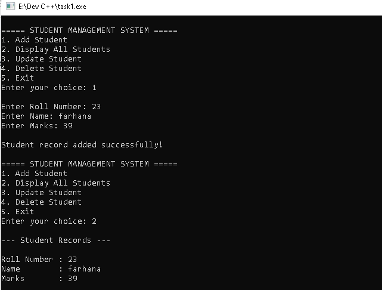

# Student Management System in C++

## Overview
This project is a console-based Student Management System developed using C++.  
It uses file handling to store student records permanently and provides a menu-driven interface for managing student details.

## Features
- Add Student Record
- Display All Students
- Update Student Record
- Delete Student Record
- File Handling using `students.txt`
- Menu-Driven Console Application

## Technologies Used
- C++
- File Handling
- Object-Oriented Programming (OOP)

## How to Run

### Compile
```bash
g++ main.cpp -o student
```

### Run
```bash
./student
```

## Sample Menu

```text
===== STUDENT MANAGEMENT SYSTEM =====
1. Add Student
2. Display All Students
3. Update Student
4. Delete Student
5. Exit
```

## Concepts Used
- Classes and Objects
- Functions
- File Handling
- Conditional Statements
- Loops
- Menu-Driven Programming

# Output Screenshots



---


## Balance Inquiry


## Output File
Student records are stored in:

```text
students.txt
```
